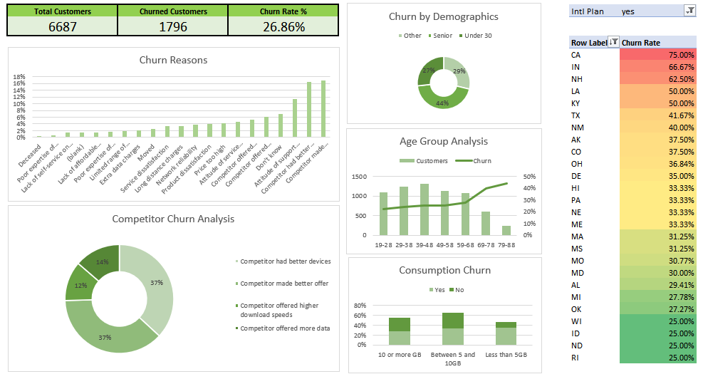
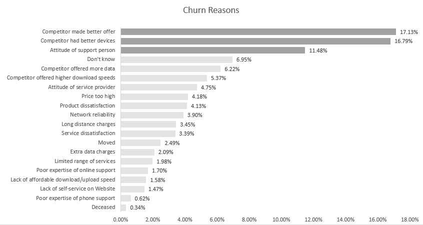
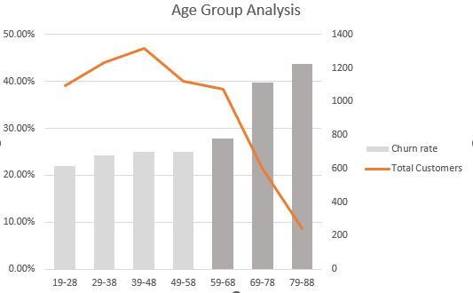
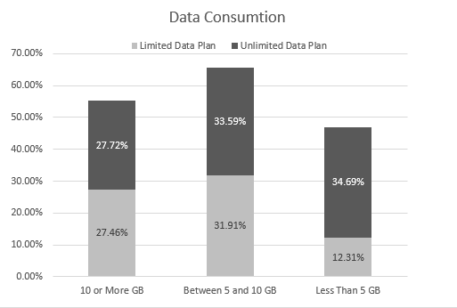

# Customer Churn Analysis – Databel Telecom Case Study

## Overview
This case study examines customer churn within a telecommunications customer base to understand why customers discontinue their services and what actions can improve retention. The analysis focuses on customer behavior, demographics, contract structures, and service usage patterns to generate practical business insights.

---
## Dashboard Preview

## Business Context
Customer churn has a direct impact on revenue stability and long-term growth. Retaining existing customers is generally more cost-effective than acquiring new ones, making churn analysis essential for strategic planning. The purpose of this project is to identify patterns associated with customer attrition and provide direction for improving customer loyalty and service competitiveness.

---

## Dataset Scope
The analysis is based on structured customer-level records supported by aggregate summaries. The customer dataset includes demographic information, contract duration, service usage behavior, and churn status, enabling both high-level trend observation and detailed segmentation.

---

## Key Findings

- The overall churn rate is approximately **27%**, indicating that more than one quarter of customers discontinued service.
- **1,766 customers** were identified as churned within the observed period.
- The most frequently reported churn drivers were related to **competitor advantages**, particularly better devices and more attractive offers.

- Customers aged **79–88**, although a small segment of the customer base, exhibited the **highest churn rates**.

- Customers with **low data consumption** showed churn likelihood close to **35%**, suggesting lower engagement or perceived value.

- Customers with **3–4 years of tenure** on **one-year contracts** were more likely to churn compared to those on longer-term agreements.
- International calling behavior showed varied loyalty patterns across different customer groups, indicating that plan relevance plays an important role in retention.

---

## Business Implications

- Competitive device offerings and promotional packages significantly influence customer decisions.
- Low-engagement users represent a hidden churn risk despite minimal service usage.
- Contract structure and renewal timing are critical points for intervention.
- Certain demographic segments may require tailored communication or service models.

---

## Recommendations

- Encourage longer-term contract commitments through targeted incentives.
- Introduce device upgrade or bundle programs to counter competitive pressure.
- Develop engagement strategies for low-usage customers to increase perceived value.
- Provide specialized support or simplified plans for senior customer segments.
- Monitor competitor pricing and offerings to maintain market competitiveness.

---

## Conclusion
The analysis highlights that customer churn is influenced by a combination of competitive market factors, contract structures, and customer engagement levels. Addressing these areas through targeted retention initiatives and customer-centric service adjustments can reduce attrition and strengthen long-term customer relationships.
